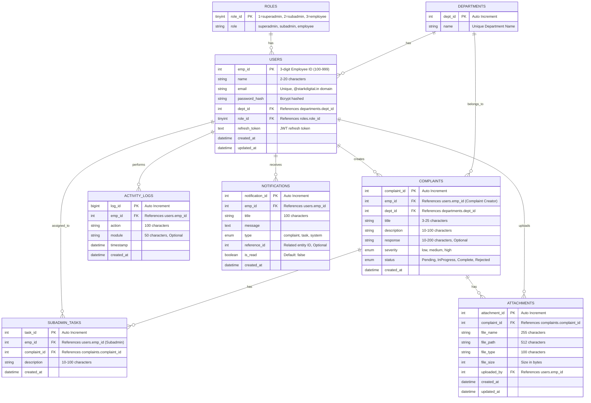
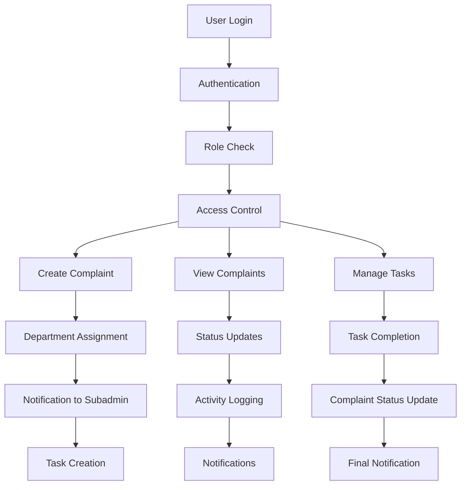

# CMS Database Entity Relationship Diagram

## Overview
This diagram represents the complete database structure for the Complaint Management System (CMS) with all tables, fields, and relationships.

## Database Schema

## Relationship Details

### 1. **User Management**
- **ROLES** → **USERS** (1:Many): Each role can have multiple users
- **DEPARTMENTS** → **USERS** (1:Many): Each department can have multiple users

### 2. **Complaint System**
- **USERS** → **COMPLAINTS** (1:Many): Users can create multiple complaints
- **DEPARTMENTS** → **COMPLAINTS** (1:Many): Complaints belong to departments
- **COMPLAINTS** → **ATTACHMENTS** (1:Many): Complaints can have multiple attachments
- **USERS** → **ATTACHMENTS** (1:Many): Users can upload multiple attachments

### 3. **Task Management**
- **USERS** → **SUBADMIN_TASKS** (1:Many): Subadmins can have multiple tasks
- **COMPLAINTS** → **SUBADMIN_TASKS** (1:Many): Complaints can have multiple tasks

### 4. **Activity Tracking**
- **USERS** → **ACTIVITY_LOGS** (1:Many): Users can have multiple activity logs

### 5. **Notifications**
- **USERS** → **NOTIFICATIONS** (1:Many): Users can receive multiple notifications

## Key Features

### 🔐 **Authentication & Authorization**
- Role-based access control (Superadmin, Subadmin, Employee)
- JWT token management with refresh tokens
- Password hashing with bcrypt

### 📋 **Complaint Management**
- Multi-department complaint system
- Severity levels (low, medium, high)
- Status tracking (Pending, InProgress, Complete, Rejected)
- File attachment support

### 👥 **User Management**
- Department-based user organization
- 3-digit employee ID system
- Email domain validation (@starkdigital.in)

### 📊 **Activity Monitoring**
- Comprehensive activity logging
- Module-based activity categorization
- Timestamp tracking

### 🔔 **Notification System**
- Multi-type notifications (complaint, task, system)
- Read/unread status tracking
- Reference ID linking to related entities

## Indexes for Performance

### **USERS Table**
- `emp_id` (Primary Key)
- `email` (Unique)
- `dept_id` (Foreign Key)
- `role_id` (Foreign Key)

### **COMPLAINTS Table**
- `complaint_id` (Primary Key)
- `emp_id` (Foreign Key)
- `dept_id` (Foreign Key)
- `status` (For filtering)

### **SUBADMIN_TASKS Table**
- `task_id` (Primary Key)
- `emp_id` (Foreign Key)
- `complaint_id` (Foreign Key)
- `created_at` (For sorting)

### **ACTIVITY_LOGS Table**
- `log_id` (Primary Key)
- `emp_id` (Foreign Key)
- `timestamp` (For date filtering)
- `module` (For module filtering)

### **NOTIFICATIONS Table**
- `notification_id` (Primary Key)
- `emp_id` (Foreign Key)
- `created_at` (For sorting)

### **ATTACHMENTS Table**
- `attachment_id` (Primary Key)
- `complaint_id` (Foreign Key)
- `uploaded_by` (Foreign Key)

## Data Flow

## Security Features

1. **Password Security**: Bcrypt hashing with salt
2. **Email Validation**: Domain-specific email addresses
3. **Role-based Access**: Three-tier permission system
4. **Input Validation**: Length and format constraints
5. **Foreign Key Constraints**: Referential integrity
6. **Audit Trail**: Complete activity logging

This database design supports a comprehensive complaint management system with proper user management, task assignment, file handling, and activity tracking capabilities. 